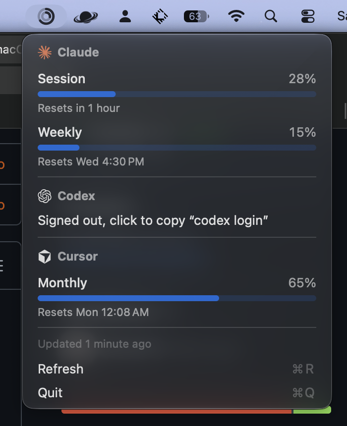

# Tokenbar

See your Claude Code, Codex and Cursor usage limits in the macOS menu bar, and get an alert at 90%.



## Install

Download `Tokenbar.dmg` from [Releases](../../releases/latest) and drag the app into Applications. On first open, go to System Settings → Privacy & Security → **Open Anyway**.

Requires macOS 13+. Uses the logins already saved by Claude Code, Codex and Cursor; tools you don't use are hidden.

## Build

```sh
./build.sh       # install locally
./build.sh dmg   # make the DMG
```

Tool logos are from [Simple Icons](https://simpleicons.org) (CC0) and are trademarks of their owners.
